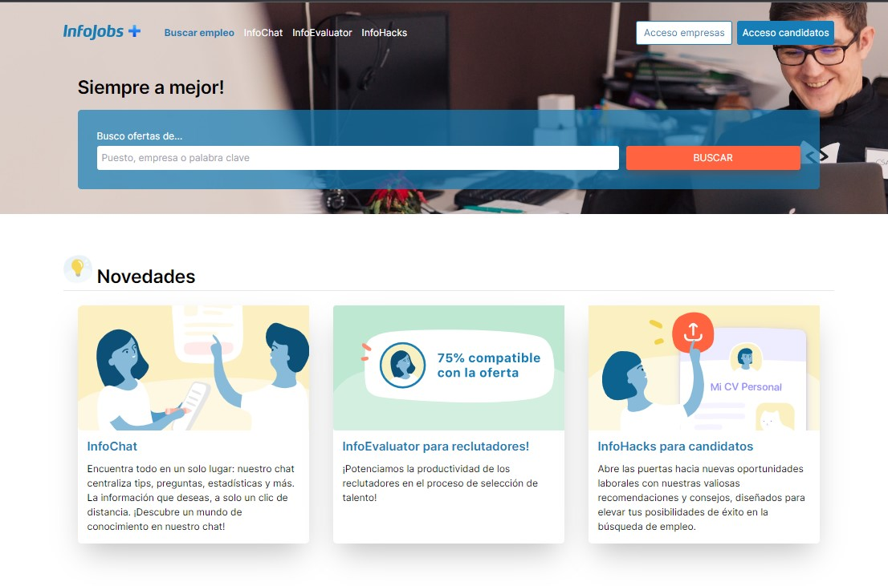
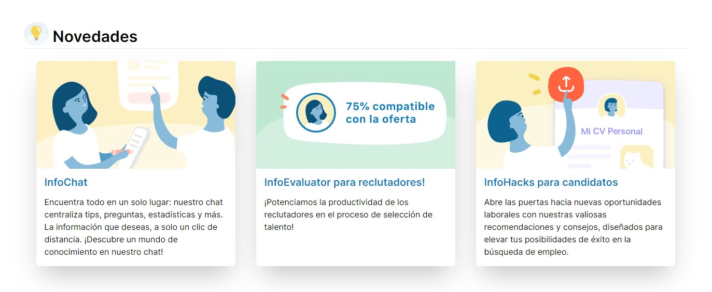
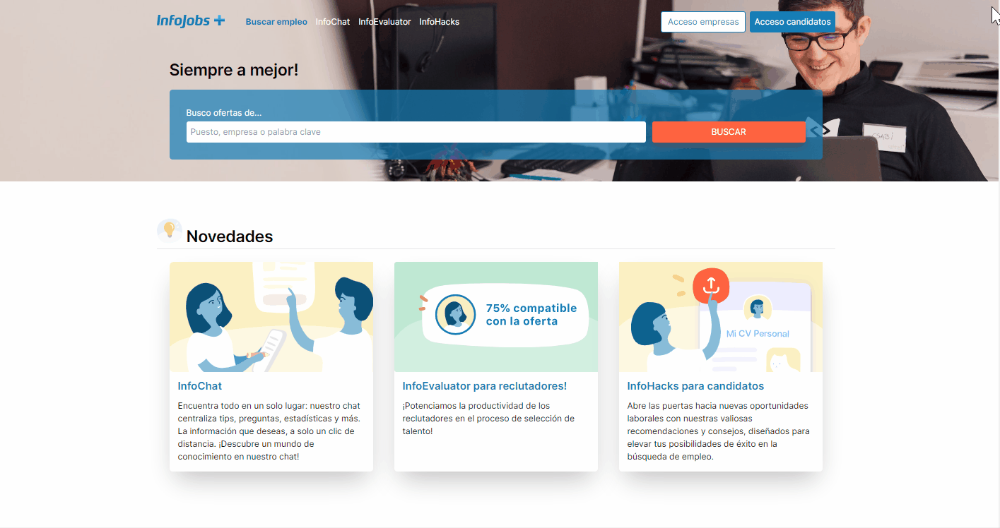

#  Infojobs Plus



Nos encontramos en un momento extraordinario de la historia, en el cual el imparable progreso tecnológico se erige como una fuerza inevitable. Hoy, nos vemos inmersos en un verdadero renacer de la inteligencia artificial, una fuerza que ha llegado para transformar nuestras vidas de manera positiva. Con gran entusiasmo y dedicación, me complace presentarles mi innovadora creación para la codiciada hackathon de Infojobs 2023: Infojobs Plus. <br/> Esta cautivadora aplicación se alza como una potencia impulsora, enriquecida por funcionalidades potenciadas por la inteligencia artificial, diseñadas para optimizar los procesos y brindar un valor excepcional al usuario final. Todo ello, en perfecta armonía con la lógica empresarial que sustenta la prominente plataforma de Infojobs.

# 💼 ¿Qué es Infojobs?

Infojobs es una reconocida plataforma digital de empleo y reclutamiento en línea.
Infojobs facilita el proceso de búsqueda de empleo al proporcionar herramientas y recursos para que los usuarios puedan crear y gestionar sus currículums, explorar las distintas ofertas disponibles, postularse a los empleos de su interés y recibir notificaciones sobre nuevas oportunidades laborales.<br/>
Además, ofrece información detallada sobre las empresas y el mercado laboral, permitiendo a los usuarios tomar decisiones informadas sobre sus trayectorias profesionales. Consulta más información en este [link](https://nosotros.infojobs.net/).

# ⭐La(s) propuesta(s)

Las funcionalidades desarrolladas giraron en torno a utilizar la IA para optimizar flujos existentes y aportar más valor al usuario final. Todas las funcionalidades las vas a encontrar en la sección de `Novedades` en la Home page:

El producto final se enfoco en 3 propuestas, las cuales vamos a abordar una por una.

## 🤖 InfoChat

Permite entablar una conversación con un asistente virtual de Infojobs, centralizando toda la información de consulta en un solo lugar. Este chat solamente esta enfocado en responder preguntas que tengan que ver con la compañia. Se puede preguntar cosas como "Cuál es la misión y visión de la compañia?" hasta solicitarle tips para escribir una oferta de trabajo. <br/>
A continuación verás una caso de uso donde se le pregunta sobre cómo aplicar a una oferta de tabajo, cómo es el proceso de selección en Infojobs, cómo es el proceso de selección en otra plataforma y que cuáles son las posiciones más demandate en el mercado actual. Luego le pediremos que mejore el encabezado de una oferta de trabajo.

Demo:


## 📈📊 InfoEvaluator para reclutadores

En busca de optimizar el proceso de selección de hojas de vida para una oferta laboral, se ha utilizado AI para analizar la correlación de una hoja de vida y la descripción de dicha oferta. La feature arroja un porcentaje de afinidad, es decir, que tan relacionada esta la hoja de vida con lo que dice la oferta de trabajo. De esta manera,
los reclutadores podrán ahorra mucho tiempo, ya que no tendrán que mirar cientos de hojas de vida, sino que se enfocarán en aquellas hojas de vida con mayor puntuación. <br/>
Esta funcionalidad se desarrollo con un límite de carga de 4 hojas de vida por cada descripción de oferta de trabajo. A continuación, se mostrará la funcionalidad partiendo de una oferta de trabajo para desarrollador Frontend en Infojobs. Se cargará 4 hojas de vida para su analisis.

Demo:


## 👩‍💻 InfoHacks para candidatos

Descubre una nueva dimensión en la búsqueda de empleo con esta innovadora funcionalidad. Ahora, los candidatos tienen el poder de potenciar sus oportunidades de ser seleccionados desde el primer paso: su hoja de vida. Infojobs plus no solo te brinda recomendaciones personalizadas para mejorar tu CV, sino que también genera preguntas de entrevista únicas y relevantes basadas en la oferta de trabajo.

Demo:


# 💻 Tecnologías

Las tecnologias utilizadas para construir esta asombrosa app fueron:

- Next.js 13: Framework de React para desarrollar aplicaciones web para producción. Se desarrollo con Typescript y se utilizo Tailwind para gestionar los estilos. Más info en este [link](https://nextjs.org/docs).
- API de InfoJobs: endpoints expuesto por la compañia para acceder a varios recursos como lo son la búsqueda de empleo, el detalle de una oferta de trabajo, entre otros. Más info en este [link](https://developer.infojobs.net/documentation/operation-list/index.xhtml).
- API de Openai (o ChatGPT): expone endpoints que son utilizados para interactuar con modelos de de IA entrenados con diferentes capacidades. Más info en este [link](https://platform.openai.com/docs/introduction).

# 🤘¡Vamos a producción!

Si quieres ver la app desplegada, dirigite al siguiente sitio web: <br />
https://hackathon-infojobs-three.vercel.app

# 🚀 ¿Arrancar la app?

¿Te gustaría ejecutar esta aplicación localmente? Para arrancar la app debes tener las diferentes variables de entorno que se utilizan para consumir los diferentes servicios:

```
INFOJOBS_TOKEN=<Token que te permite consumir endpoints de Infojobs>
OPENAI_API_KEY_INFOHINTS_RECRUITERS=<key para consumir los servicios de openai>
OPENAI_API_KEY_INFOHACKS=<key para consumir los servicios de openai>
OPENAI_API_KEY_INFOCHAT=<key para consumir los servicios de openai>
```

Para generar `INFOJOBS_TOKEN`, tienes que visitar la página web de [Infojobs para desarrolladores](https://developer.infojobs.net/). <br/>
Encontrarás varias variables para consumir los servicios de openapi con el mismo prefijo `OPENAI_API_KEY_*`. Pueden ser iguales o diferentes. Te tienes que asegurar que tu cuenta tenga suficientes fondos
para realizar las peticiones. Visita la página de [openai](https://platform.openai.com/docs/quickstart/adjust-your-settings) para obtener el token.

Luego, debes instalar las dependencias y ejecutar el proyecto así:

```bash
npm run install # Instalar todas las dependencas
npm run dev # Correr el proyecto en local
```

\*Nota: Esta app fue desarrollada con la versión 18.16.0 de Node.

# 📍 Conclusión

En resumen, Infojobs Plus es la culminación de la innovación en el campo de la inteligencia artificial y la búsqueda de trabajo. Esta fascinante aplicación va más allá de lo convencional al incorporar funcionalidades extraordinarias que empoderan tanto a reclutadores como a candidatos. Enfocada en tres aspectos clave, esta plataforma revoluciona la forma en que se lleva a cabo el proceso de selección y búsqueda de empleo, así como la postulación a ellos:

- Potencia la productividad de los reclutadores al aprovechar la inteligencia artificial para optimizar la selección de currículums. Con AI, se agiliza y perfecciona la evaluación de las hojas de vida, permitiendo a los profesionales del reclutamiento enfocarse en los candidatos más prometedores.
- Eleva el nivel de interacción con los usuarios a través de un chatbox mejorado. Dotada de habilidades adicionales, esta función ofrece respuestas más útiles y sofisticadas, brindando una experiencia personalizada y enriquecedora para el usuario final.
- Brinda herramientas útiles y exclusivas a los candidatos. Desde recomendaciones personalizadas para mejorar su currículum hasta preguntas autogeneradas para entrevistas basadas en las ofertas de trabajo, Infojobs Plus proporciona recursos valiosos que impulsan el éxito de los postulantes en su búsqueda de empleo.<br/>

Estas innovaciones destacadas añaden un plus significativo al núcleo principal del negocio de Infojobs, elevando la plataforma a un nuevo nivel de excelencia y redefiniendo la forma en que las personas encuentran oportunidades profesionales.
